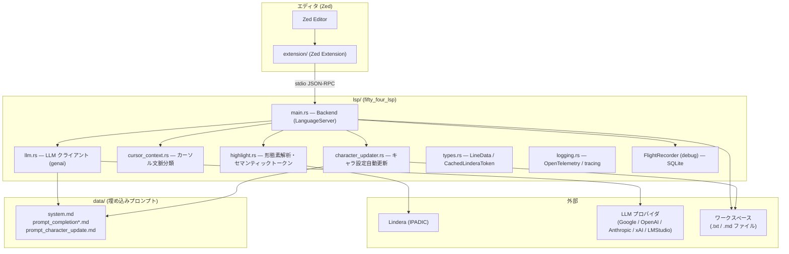
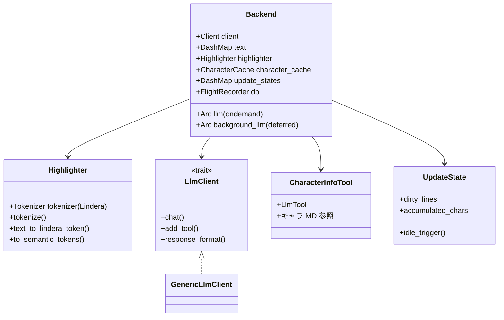

# 全体アーキテクチャ

## システム構成

## Backend コンポーネント

`main.rs` の `Backend` が LSP の中心。主要フィールドとモジュールの関係:

## LLM クライアントの二系統

初期化オプション `llm` から 2 種類のクライアントを構築する。

| クライアント | 設定キー | 用途 |
|---|---|---|
| `llm` | `llm.ondemand` | 文章補完（ユーザー操作に同期） |
| `background_llm` | `llm.deferred`（未指定時は `ondemand` と同じ） | キャラ設定更新（バックグラウンド） |

どちらも `LlmClientBuilder` → `GenericLlmClient` 経由で `genai` クレートを利用する。プロバイダは Google / OpenAI / Anthropic / xAI / LMStudio に対応。

## エージェント（AGENTS.md との対応）

| エージェント | 実装 | 役割 |
|---|---|---|
| LSP サーバエージェント | `main.rs` (`Backend`) | initialize / shutdown / テキスト同期 / 各 LSP ハンドラ |
| 会話ハイライトエージェント | `highlight.rs` (`Highlighter`) | Lindera 形態素解析 → セマンティックトークン生成 |
