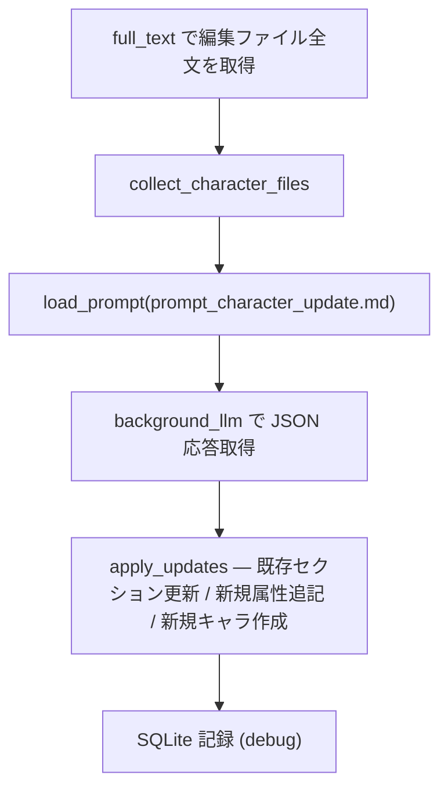

# キャラクター設定自動更新

執筆中の本文から LLM がキャラクター設定の更新案を生成し、ワークスペース内のキャラ MD ファイルへ反映するバックグラウンド機能。

## 状態遷移

```mermaid
stateDiagram-v2
    [*] --> Accumulating: did_change
    Accumulating --> Accumulating: 編集継続 (delta 加算)
    Accumulating --> FireIdle: idle_timeout 経過 & min_chars 以上
    Accumulating --> ClearStale: idle_timeout 経過 & min_chars 未満
    Accumulating --> FireMax: max_chars 到達
    ClearStale --> Accumulating: バースト破棄 → 新規開始
    FireIdle --> Running: tokio::spawn(run)
    FireMax --> Running
    Running --> Accumulating: 完了 (running=false)
```

## 発火条件

`record_change`（`did_change` から呼ばれる）が URI ごとの `UpdateState` を更新し、発火を判定する。

| 条件 | デフォルト | 動作 |
|---|---|---|
| `idle_timeout_secs` 経過 + `min_chars` 以上 | 180 秒 / 1000 文字 | `Trigger::Fire` — 更新タスク起動 |
| `idle_timeout_secs` 経過 + `min_chars` 未満 | — | `Trigger::ClearStale` — 蓄積破棄 |
| `max_chars` 到達 | 5000 文字 | 即時 `Fire` |
| `running == true` | — | カウントのみ（二重起動防止） |

キャラクター設定ファイル自体への編集はトリガ対象外。

## run タスクの処理

`character_updater::run` が `tokio::spawn` で非同期実行される。



1. 編集中ファイルの全文を取得(発火判定の差分カウントとは独立)
2. ワークスペース内のキャラ MD ファイルを収集
3. `prompt_character_update.md` を LLM に送信（全文テキスト）
4. JSON 応答をパース → 各キャラの `CharacterAttribute` セクションを更新・追記、または新規キャラのファイル/ブロックを作成
5. debug ビルド時は `character_updates` / `character_update_sections` テーブルに記録

## CharacterAttribute

キャラ MD 内の更新対象セクション。例:

- 外見、性格、背景、関係性 等（`main.rs` の `CharacterAttribute` enum）

## 設定

`initialize` の `character_updater` オプション、または `did_change_configuration` で変更可能。

| キー | 説明 |
|---|---|
| `enabled` | 機能の有効/無効 |
| `min_chars` | idle 発火に必要な最小文字数 |
| `max_chars` | 即時発火する最大文字数 |
| `idle_timeout_secs` | 最終編集からの待機秒数 |
