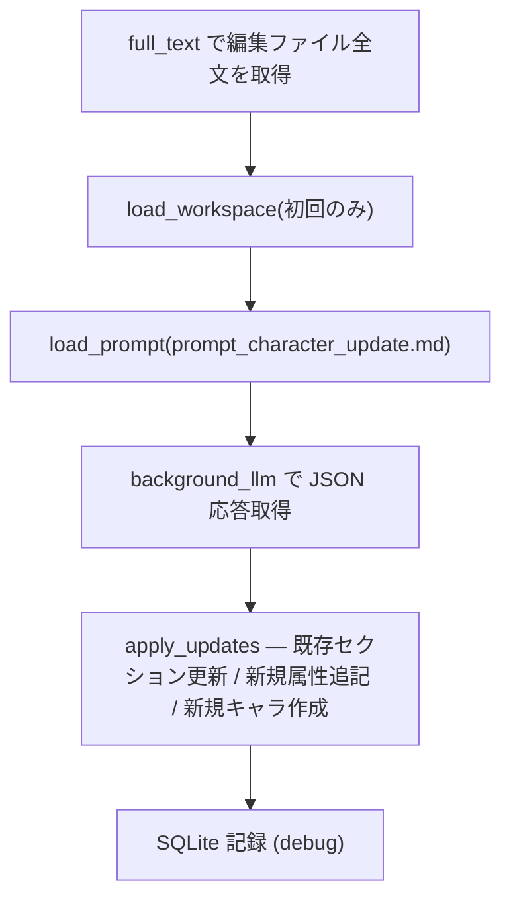

# キャラクター設定自動更新

執筆中の本文から LLM がキャラクター設定の更新案を生成し、ワークスペース内のキャラ MD ファイルへ反映するバックグラウンド機能。

## 状態遷移

```mermaid
stateDiagram-v2
    [*] --> Accumulating: did_change
    Accumulating --> Accumulating: 編集継続 (delta 加算)
    Accumulating --> FireIdle: idle_timeout 経過 & min_chars 以上
    Accumulating --> ClearStale: idle_timeout 経過 & min_chars 未満
    Accumulating --> FireMax: max_chars 到達
    ClearStale --> Accumulating: バースト破棄 → 新規開始
    FireIdle --> Running: tokio::spawn(run)
    FireMax --> Running
    Running --> Accumulating: 完了 (running=false)
```

## 発火条件

`record_change`（`did_change` から呼ばれる）が URI ごとの `UpdateState` を更新し、発火を判定する。

| 条件 | デフォルト | 動作 |
|---|---|---|
| `idle_timeout_secs` 経過 + `min_chars` 以上 | 180 秒 / 1000 文字 | `Trigger::Fire` — 更新タスク起動 |
| `idle_timeout_secs` 経過 + `min_chars` 未満 | — | `Trigger::ClearStale` — 蓄積破棄 |
| `max_chars` 到達 | 5000 文字 | 即時 `Fire` |
| `running == true` | — | カウントのみ（二重起動防止） |

キャラクター設定ファイル自体への編集はトリガ対象外。

## run タスクの処理

`character_updater::run` が `tokio::spawn` で非同期実行される。

```mermaid
flowchart TD
    A["full_text で編集ファイル全文を取得"] --> B["load_workspace(初回のみ)"]
    B --> C["load_prompt(prompt_character_update.md)"]
    C --> D["background_llm で JSON 応答取得"]
    D --> E["apply_updates — 既存セクション更新 / 新規属性追記 / 新規キャラ作成"]
    E --> F["SQLite 記録 (debug)"]
```

1. 編集中ファイルの全文を取得(発火判定の差分カウントとは独立)
2. `character_store` が当該ワークスペース未ロードなら `load_workspace` で読み込む。1件も無ければ
   `characters.md` を新規作成して処理を続ける
3. `prompt_character_update.md` を LLM に送信(全文テキスト)
4. JSON 応答をパース → `apply_updates` が更新先ファイルを解決して適用(下記「wikilink 対応」参照)
5. debug ビルド時は `character_updates` / `character_update_sections` テーブルに記録

## 更新先ファイルの解決

候補ファイルは `characters.md`(追跡ファイル)だけでなく、そこから `[[wikilink]]` で推移的に
到達可能な全ファイルまで広げてある(`CharacterStore::files_reachable_via_wikilink`)。
その中から宛先を選ぶ規則は2段階:

| ケース | 宛先 |
|---|---|
| 既存キャラ | **候補ファイルを横断検索**し、実際にその見出し(部分一致)または alias(完全一致)を持つファイル |
| 新規キャラ | 常に `characters.md`(`find_aggregate_file`) |

**ファイル名からキャラ名を推測しない**のが要点。以前は `find_character_file` がファイル名 stem の
前方一致で宛先を選んでいたが、候補が任意の `.md` へ広がった今この推測は成立しない:

- ファイル名とキャラ名が一致しないケース(`hoge/ijn.md` の「原顕三郎」)を取りこぼし、
  `characters.md` へ重複ブロックを作ってしまう
- 無関係なメモ(`memo/原稿メモ.md`)がキャラ「原」の宛先に選ばれうる

横断検索は `characters/<名>.md` 相当の配置も当然カバーするため、stem マッチは完全に不要になった。
候補の走査順は `HashMap` 由来で不定なので、`apply_updates` でパスの昇順にソートし、同じキャラが
複数ファイルに現れた場合の宛先を安定させている。

### 追跡対象への昇格と同期

`files_reachable_via_wikilink` は、新たに見つけたファイルをその場で `reconcile` し追跡ファイルへ
昇格させる。そうしないと `apply_ops_to_file` の `content_of` 呼び出しが失敗し、書き込みが黙って
スキップされる(`CharacterStore` の読み書き系メソッドはすべてメモリ上の追跡ファイルだけを見る)。

昇格したファイルが以後もディスクと同期され続ける仕組み(watcher の範囲・`is_tracked` による
絞り込み)は `docs/lsp-handlers.md` の「追跡対象の昇格と同期」を参照。

### 書き込み後の後始末

- `apply_updates` は `apply_plan` の後に `character_store.refresh_included` を呼び、wikilink 先
  ファイルの変更を参照元ファイルの `included_characters`/`included_character_files` へ波及させる。
- `record_change`(`backend.rs`)は `run` 完了後に `refresh_highlight_names_with` を呼び、
  自動更新で追記・更新されたキャラ名を Lindera ユーザー辞書へ反映する
  (自己書き込みは `reconcile` のエコー検出で無視されるため、`did_save` 側では発火しない)。

## CharacterAttribute

キャラ MD 内の更新対象セクション。例:

- 外見、性格、背景、関係性 等（`main.rs` の `CharacterAttribute` enum）

## 実装上の注意点

- **`run` へ渡す `workspace` は呼び出し元で解決済みのものを使う。** 発火元ドキュメントの
  URI から `CharacterStore::resolve_workspace_for` で都度解決する(`Backend::record_change`)。
  以前は常に最初に開いたワークスペース(`workspace_arc.first()`)を使っていたため、複数
  ワークスペースを開いていると誤ったワークスペースへ書き込むバグがあった。
- **Alias(呼称)属性は LLM ではなく決定的マージ。** 呼称は名前の列挙であり自由記述では
  ないため、`merge_alias_bodies` が `split_aliases` で分割した別名リストを順序保持のまま
  結合する(LLM の意味マージだと1行の文章に統合されてしまう)。`split_aliases` は「：」
  「:」を分割文字に含まないため、過去のバグで属性ラベルが1トークンに混入したまま
  保存された旧データ(例:「呼称：飛騨艦長」)が残っている場合がある。各トークンに
  `strip_attribute_label` を適用してから比較することで、新しく来た清潔な形と同一別名として
  認識し、重複を防ぎつつ自己修復する。

## 設定

`initialize` の `character_updater` オプション、または `did_change_configuration` で変更可能。

| キー | 説明 |
|---|---|
| `enabled` | 機能の有効/無効 |
| `min_chars` | idle 発火に必要な最小文字数 |
| `max_chars` | 即時発火する最大文字数 |
| `idle_timeout_secs` | 最終編集からの待機秒数 |
