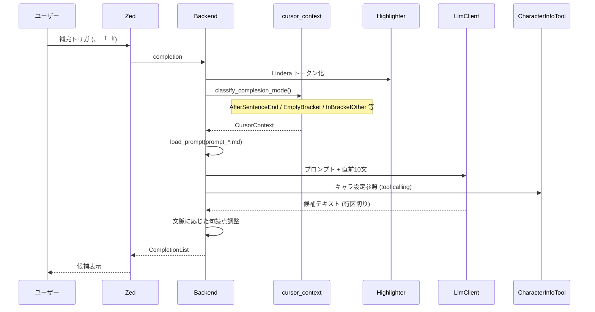

# 文章補完

## フロー

## CursorContext

`cursor_context::classify_complesion_mode` が Lindera トークンと括弧状態から文脈を分類する。結果に応じてプロンプトファイルを切り替える。

| CursorContext | プロンプトファイル | 説明 |
|---|---|---|
| `AfterSentenceEnd` | `prompt_completion_after_sentence.md` | 文末 `。` の直後 |
| `AfterClosingBracket` | `prompt_completion_after_bracket.md` | `」` の直後 |
| `EmptyBracket` | `prompt_completion_empty_bracket.md` | 空の `「」` 内 |
| `InBracketOther` | `prompt_completion_in_bracket.md` | 括弧内その他 |
| `BeforeClosingBracket` | `prompt_completion_before_bracket.md` | 括弧内 `」` 直前 |
| `Other` | `prompt_completion.md` | 上記以外 |

## 文脈取得

- `before_sentences_upto`: カーソル位置から最大 10 文分の直前文を収集
- 必要に応じて Lindera トークンを遅延解析（`LineData.tokens` が空の場合）

## 候補の後処理

LLM 応答（行区切り）を `CursorContext` に応じて整形してから `CompletionItem` に変換する。

| 文脈 | 整形ルール |
|---|---|
| `BeforeClosingBracket` | 先頭に `。` を付与、末尾の `。` は除去 |
| `EmptyBracket` | 末尾の `。` を除去 |
| `AfterClosingBracket` | 先頭に改行を付与 |
| その他 | 末尾に `。` を付与（なければ） |

25 文字超の候補は短縮ラベル + Markdown ドキュメントとして全文を表示。

## CharacterInfoTool

補完時に LLM へ tool として登録。ワークスペース内のキャラクター MD を参照し、登場人物の設定情報を補完コンテキストに提供する。

- キャラ MD は `comrak` + frontmatter でパース（`parse_all_content`）
- 結果は `CharacterCache` にキャッシュ

## debug 記録

debug ビルドでは `FlightRecorder` が補完リクエストと候補を SQLite に記録する。

- `completions` テーブル: URI、カーソル位置、モデル、プロンプト
- `completion_candidates` テーブル: 候補テキスト、選択状態
