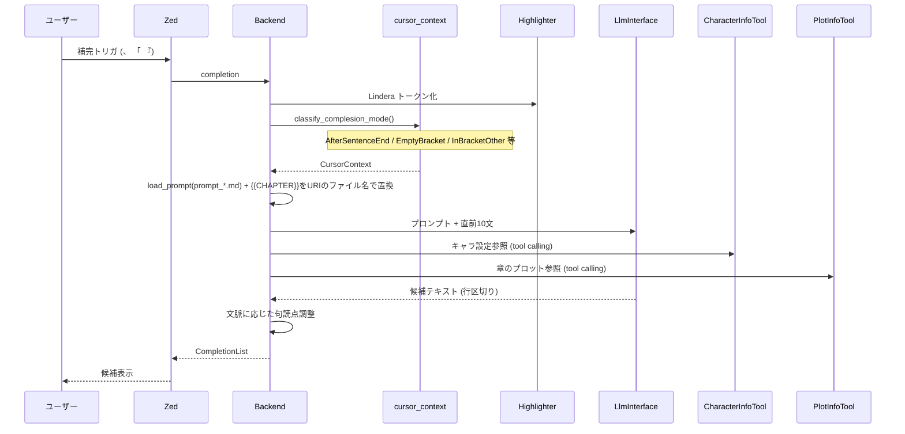

# 文章補完

## フロー

```mermaid
sequenceDiagram
    participant User as ユーザー
    participant Zed as Zed
    participant Backend as Backend
    participant CC as cursor_context
    participant HL as Highlighter
    participant LLM as LlmInterface
    participant CTool as CharacterInfoTool
    participant PTool as PlotInfoTool

    User->>Zed: 補完トリガ (、 「 『)
    Zed->>Backend: completion
    Backend->>HL: Lindera トークン化
    Backend->>CC: classify_complesion_mode()
    Note over CC: AfterSentenceEnd / EmptyBracket / InBracketOther 等
    CC-->>Backend: CursorContext
    Backend->>Backend: load_prompt(prompt_*.md) + {{CHAPTER}}をURIのファイル名で置換
    Backend->>LLM: プロンプト + 直前10文
    Backend->>CTool: キャラ設定参照 (tool calling)
    Backend->>PTool: 章のプロット参照 (tool calling)
    LLM-->>Backend: 候補テキスト (行区切り)
    Backend->>Backend: 文脈に応じた句読点調整
    Backend-->>Zed: CompletionList
    Zed-->>User: 候補表示
```

## CursorContext

`cursor_context::classify_complesion_mode` が Lindera トークンと括弧状態から文脈を分類する。結果に応じてプロンプトファイルを切り替える。

| CursorContext | プロンプトファイル | 説明 |
|---|---|---|
| `AfterSentenceEnd` | `prompt_completion_after_sentence.md` | 文末 `。` の直後 |
| `AfterClosingBracket` | `prompt_completion_after_bracket.md` | `」` の直後 |
| `EmptyBracket` | `prompt_completion_empty_bracket.md` | 空の `「」` 内 |
| `InBracketOther` | `prompt_completion_in_bracket.md` | 括弧内その他 |
| `BeforeClosingBracket` | `prompt_completion_before_bracket.md` | 括弧内 `」` 直前 |
| `Other` | `prompt_completion.md` | 上記以外 |

## 文脈取得

- `before_sentences_upto`: カーソル位置から最大 10 文分の直前文を収集
- 必要に応じて Lindera トークンを遅延解析（`LineData.tokens` が空の場合）

`before_sentences_upto` のトークン境界計算には過去に2件の実機バグ修正が入っている:

- カーソルがトークン境界上にある場合、そのトークンを消費してはならない。以前はカーソルの
  乗ったトークン全体を push してから `last_byte` をそのトークンの終端へ進めていたため、
  閉じ括弧直前などでカーソル位置より後方の文字が混入・重複していた。現在はカーソル位置を
  `last_byte` のまま残し、後続のループに「直前トークンの開始 〜 カーソル位置」をまとめて
  取り込ませることで回避している。
- カーソルを含むトークンが見つからない場合（行頭の空白の直前・行末など）、`last_byte` 以前に
  完全に収まっているトークンの数をカウントしてインデックスとする。以前は無条件に行末扱いへ
  倒していたため、行頭で一致しないケースを行末と誤認し、後段のスライスで逆転レンジ
  （終端 < 始端）を作って panic していた。

## 候補の後処理

LLM の生応答は `extract_candidate_lines`(`cursor_context.rs`)で候補行の列へ分割してから、
`CursorContext` に応じて整形して `CompletionItem` に変換する。

モデルはまれに「これから挙げる候補の意図」を独り言のように書き出してから空行を挟んで
実際の候補を続けることがある（観測例: 意図説明2行 + 空行 + 実際の候補3行、という計6行の
応答）。そのまま行分割するとダミー候補が混入するため、応答内に空行があれば**最後の空行
より後ろ**を実際の候補群とみなす経験則で対処している（モデルが前置きと本題を空行で区切る、
という観測された振る舞いへの対応）。空行が無い、または空行の後ろに実質的な行が無い場合は、
全体から空行だけを除いたものを返す。

その後、`CursorContext` に応じて次の整形ルールを適用する:

| 文脈 | 整形ルール |
|---|---|
| `BeforeClosingBracket` | 先頭に `。` を付与、末尾の `。` は除去 |
| `EmptyBracket` | 末尾の `。` を除去 |
| `AfterClosingBracket` | 先頭に改行を付与 |
| その他 | 末尾に `。` を付与（なければ） |

25 文字超の候補は短縮ラベル + Markdown ドキュメントとして全文を表示。

## CharacterInfoTool / PlotInfoTool

補完時に LLM へ tool として登録(`tools.rs`)。LLM がtool callするかはプロンプト・文脈次第で、必ず呼ばれるとは限らない。

**CharacterInfoTool**: ワークスペース内のキャラクター MD を参照し、登場人物の設定情報を補完コンテキストに提供する。

- キャラ MD は `comrak` + frontmatter でパース（`parse_all_content`）
- 結果は `CharacterCache` にキャッシュ

**PlotInfoTool**: ワークスペースの `plot.md` を参照し、章のプロット概要を提供する。`chapter_name` 引数(省略可、省略時は全章)で章を指定する。`plot.md` の `# 章名` を章区切りとして `parse_plot_md` でパースする。キャッシュは持たない。

`completion` は現在編集中のファイル名(拡張子抜き)を `{{CHAPTER}}` としてプロンプトへ埋め込むため、LLM が `PlotInfoTool` に渡す `chapter_name` の手がかりになる。

`completion`(および `code_action`)は、カーソル位置が章のどのあたりかを `{{PROGRESS}}` としても埋め込む。分子は「バッファ先頭からカーソル位置までの文字数」(`Backend::chars_before_cursor`)、分母は `plot.md` の front matter にある `average_chars`(1話あたりの予定文字数)。`plot.md` が無い・`average_chars` 未設定の場合は空文字列になる(`{{PROGRESS}}` プレースホルダ自体がプロンプトに残ることはない。`frontmatter::expand` は未知のプレースホルダのみ `{{NAME}}` の形で残す仕様なので、空文字列を明示的に渡す必要がある)。LLM はこの進捗を手がかりに、`PlotInfoTool` で取得したプロット全体のうち今の進行度に対応する箇所を選んで参照する。

`CharacterInfoTool` の実体である `CharacterStore::search` は `included_characters`(`[[wikilink]]` 先を `#include` のように推移的に展開してからパースした結果)を検索するため、`characters.md` 自身に見出しの無い、wikilink 経由でしか定義されていないキャラも見つかる(要約はしない。常に全文を渡す。`PlotInfoTool` には実装していない。詳細は `docs/lsp-handlers.md` の「wikilink」参照)。

## debug 記録

debug ビルドでは `FlightRecorder` が補完リクエストと候補を SQLite に記録する。

- `completions` テーブル: URI、カーソル位置、モデル、プロンプト
- `completion_candidates` テーブル: 候補テキスト、選択状態
