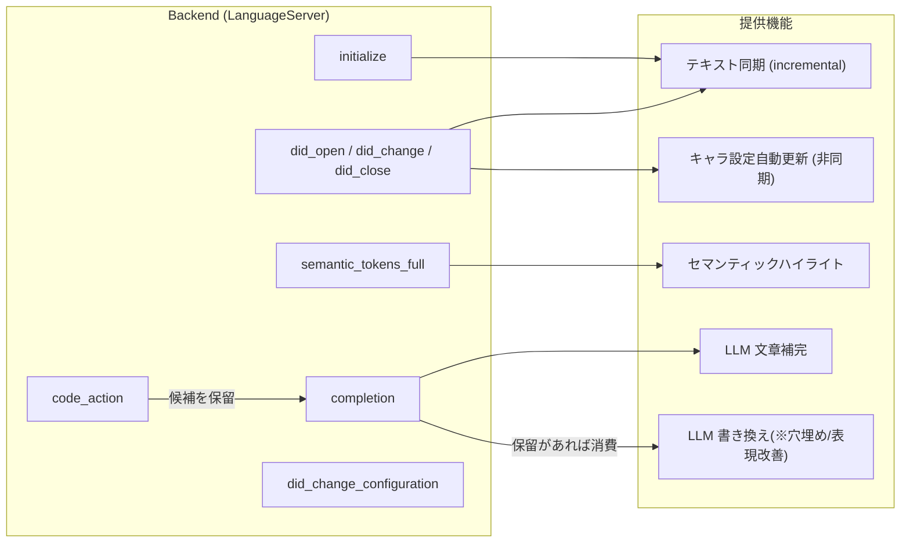

# LSP ハンドラ

## 機能マップ



## ハンドラ一覧

| ハンドラ | 役割 |
|---|---|
| `initialize` | capabilities 宣言、ワークスペース初期化、LLM / character_updater 設定読み込み |
| `initialized` | クライアント設定の取得 |
| `shutdown` | シャットダウン（現状は即時 OK） |
| `did_open` | 行単位テキスト保持、セマンティックトークン refresh |
| `did_change` | 増分更新、補完選択の記録 (debug)、キャラ更新トリガ、トークン refresh |
| `did_close` | ドキュメント状態のクリーンアップ |
| `semantic_tokens_full` | Lindera 形態素解析 → 品詞ベースの色分け |
| `hover` | カーソル位置のキャラ名(表示名・別名とも)に対し、そのキャラの全セクションを Markdown で表示 |
| `goto_definition` | カーソル位置のキャラ名(表示名・別名とも)から `characters.md` / `characters/*.md` の該当キャラ見出しへジャンプ。同名キャラが複数ファイルにあれば候補一覧を返す。判定基準は `hover` と共通(ハイライトされない語では発動しない)。**カーソルが既に定義位置(キャラ見出し行)にある場合は `references` にフォールバックする**(rust-analyzer / IntelliJ 等と同じ振る舞い) |
| `references` | カーソル位置のキャラ名(表示名・別名とも)の登場箇所を、ワークスペース直下(非再帰)の本文 `.txt` から横断検索して返す(Find All References)。判定基準は `hover`/`goto_definition` と共通。`characters.md` 等の設定・メモ類はスキャンしない |
| `inlay_hint` | `plot.md` の各 `# 章名` 見出し行末に「現文字数/予定文字数」を表示する。`plot.md` 以外のドキュメントには何も返さない。現文字数は対応する `<章名>.txt` から算出(開いていればバッファ優先、無ければディスク)。front matter に `episodes`/`average_chars` があれば予定文字数も表示し、front matter を閉じる行に作品全体の合計進捗も出す |
| `completion` | カーソル文脈に応じた LLM 補完候補生成。`code_action` が置いた保留中の書き換え候補があれば、それを優先して返す(下記参照) |
| `code_action` | 選択範囲(無ければカーソルの文)を LLM で書き換える。対象に「※」があればそこに当てはまる語、無ければ表現改善の候補を複数提示する。ユーザーが明示的に要求した場合(`trigger_kind == INVOKED`、または未送信で選択範囲あり)のみ LLM を呼ぶ(電球表示のための自動呼び出しでは呼ばない)。`CodeAction.title` は1行の短い文字列しか持てず(LSP 仕様に documentation 相当のフィールドが無い)長文・改行を表示できないため、候補そのものはメニューに出さず `Ok(None)` を返す。生成した候補は uri ごとに保留し(`Backend::pending_rewrite`)、`window/showMessage` でユーザーに通知する |
| `did_change_configuration` | ランタイム設定変更 |
| `did_change_workspace_folders` | ワークスペースフォルダ変更 |

## 宣言される capabilities

`initialize` で返却する主要機能:

| Capability | 設定 |
|---|---|
| `textDocumentSync` | `INCREMENTAL` |
| `positionEncoding` | `UTF16`（LSP必須ベースライン。Position.character はUTF-16コード単位） |
| `semanticTokensProvider` | full のみ（range 無効）、FiftyFour / file スキーム |
| `completionProvider` | トリガ: `、` `「` `『` / コミット: `。` `」` `』` |
| `codeActionProvider` | `CodeActionKind::REFACTOR_REWRITE`。selection/cursor の文を LLM で書き換える |
| `selectionRangeProvider` | 有効 |
| `hoverProvider` | 有効 |
| `definitionProvider` | 有効。キャラ名(表示名・別名とも)から `characters.md` の該当見出しへジャンプ |
| `referencesProvider` | 有効。キャラ名(表示名・別名とも)の登場箇所をワークスペース直下の本文 `.txt` から横断検索 |
| `inlayHintProvider` | 有効。`plot.md` の章見出しに現文字数/予定文字数を表示(下記参照) |

## plot.md の front matter と inlay hint

`plot.md` は先頭に YAML front matter を置ける(`gray_matter` でパース。`lsp/src/plot.rs`)。

```markdown
---
episodes: 54       # 話数(全体の目標算出に使う。episodes × average_chars)
average_chars: 4000 # 1話あたりの平均(予定)文字数
---

# 第1章
...
```

`plot.md` を開くと、各 `# 章名` 見出し行末に inlay hint で `現文字数/予定文字数` が表示される
(`average_chars` が無ければ現文字数のみ)。現文字数は「ワークスペース直下の `<章名>.txt`」の
規約に従って算出する。対応する `.txt` が開いていればそのバッファ(編集中の内容)を優先し、
無ければディスクから読む。存在しなければ `0`。`.txt` の保存・外部変更時は
`workspace/inlayHint/refresh` でクライアントへ再取得を促す。

### 前提設定(Zed)

上記が動くには、サーバ側の capability 宣言(`inlayHintProvider`)に加えて Zed 側の設定が2つ要る。
どちらか一方でも欠けると `textDocument/inlayHint` 自体がサーバへ飛ばない。

1. **`plot.md` を `FiftyFour` 言語として認識させる。**
   `extension/languages/fiftyfour/config.toml` の `path_suffixes` に `"plot.md"` が含まれている
   こと(`["txt", "plot.md", "characters.md"]`)。この LSP はバッファの言語が `FiftyFour` の場合
   にしかアタッチされないため、ここに無いと `initialize` すら送られない
   (`.txt` だけしか登録されていなかった時期は、まさにこれが原因で `plot.md` 側の
   `inlay_hint` ハンドラが一度も呼ばれなかった)。設定ファイルの変更だけなので Rust 側の
   再ビルドは不要。Zed で `zed: reload extensions` するか Zed を再起動して反映する。
2. **Zed の `inlay_hints.enabled` を有効にする。** Zed は既定で inlay hint 表示自体が
   オフなので、`settings.json` に以下を追加する(`FiftyFour` 言語限定でもよい):
   ```json
   {
     "inlay_hints": { "enabled": true }
   }
   ```
   これは LSP の `initializationOptions`(`lsp.fifty-four.*`)とは別物で、Zed 側の
   エディタ設定(トップレベルまたは `languages.FiftyFour.*`)に書く。

`episodes` と `average_chars` が両方あれば、front matter を閉じる行にも
`合計 現文字数合計/(episodes × average_chars)` の hint を表示する。

## 初期化オプション

Zed 拡張(`extension/src/lib.rs` の `language_server_initialization_options`)が settings.json の
**`lsp.fifty-four.initialization_options`** を読み取り、そのまま `initialize` の
`initializationOptions` として LSP へ渡す。`fifty-four` は `extension/extension.toml` の
`id`(= Zed 拡張の識別子)と一致させる必要がある。

**重要**: Zed の `LspSettings` は `binary` / `initialization_options` / `settings` という決まったフィールドしか解釈しない。`character_updater` や `llm` を `lsp.fifty-four` 直下に書くと**黙って無視され**、LLM が未初期化のまま補完実行時に `LlmError::NotInitialized` になる。必ず `initialization_options` の下にネストすること。

```json
{
  "lsp": {
    "fifty-four": {
      "binary": {
        "path": "...",
        "arguments": [],
        "env": {}
      },
      "initialization_options": {
        "character_updater": {
          "enabled": true,
          "min_chars": 1000,
          "max_chars": 5000,
          "idle_timeout_secs": 180
        },
        "llm": {
          "ondemand": { "provider": "...", "model": "..." },
          "deferred": { "provider": "...", "model": "..." }
        }
      }
    }
  }
}
```

`binary` / `initialization_options`(とその中の `character_updater` / `llm`)は**いずれも省略可能**。省略時の挙動は各節で説明する。以下、`character_updater` / `llm` の説明はすべて `initialization_options` 内に書く前提とする(節見出しではネストを省略して表記)。

### `binary`

LSP バイナリの起動コマンドを指示する(Zed 拡張側、`extension/src/lib.rs:20-32` が解釈)。

| フィールド | 必須 | 説明 |
|---|---|---|
| `path` | 任意 | LSP 実行ファイルの絶対パス。**省略時**は拡張が (1) PATH 上の `fifty_four_lsp`(Windows は `.exe`)、(2) 拡張の作業ディレクトリ配下を再帰探索、の順にフォールバックする。開発ビルドを都度拾わせたい場合以外は明示指定を推奨(配布 `dist/` 直下に置けば再帰探索でも見つかるが、複数バージョンが混在すると意図しないものを拾う恐れがある) |
| `arguments` | 任意 | 起動時の追加コマンドライン引数。現状 LSP 側は引数を解釈しないため通常不要 |
| `env` | 任意 | 起動プロセスへ渡す環境変数。**注意**: settings.json は平文で保存されるため、`GEMINI_API_KEY` 等の API キーをここに書かない。API キーは OS のユーザー環境変数に設定し、Zed を完全再起動して継承させる |

### `character_updater`

バックグラウンドのキャラクター設定自動更新(`character_updater::run`)の発火条件。全フィールド省略可能、省略したフィールドは既定値(`lsp/src/character_updater.rs` の `DEFAULT_MIN_CHARS`=1000 / `DEFAULT_MAX_CHARS`=5000 / `DEFAULT_IDLE_SECS`=180、`enabled` は既定 `true`)を使う。`character_updater` キー自体を省略した場合も同様に全項目デフォルトで動作する。

| フィールド | 既定値 | 説明 |
|---|---|---|
| `enabled` | `true` | `false` を明示した場合のみ無効化(`true` や未指定は有効) |
| `min_chars` | `1000` | 直前の編集バーストが idle 確定した際、この文字数以上蓄積していれば発火 |
| `max_chars` | `5000` | 編集継続中でもこの文字数に達したら idle を待たず即時発火 |
| `idle_timeout_secs` | `180` | 編集が止まってからこの秒数経過で「バースト確定」とみなす |

### `llm`

補完(`ondemand`)とキャラ設定更新(`deferred`)それぞれに使う LLM 接続設定。**`llm` キー自体を省略すると両方とも初期化されず**、補完とキャラ設定自動更新は動作しない(セマンティックハイライトなど LLM 非依存の機能には影響しない)。

- `ondemand`: `completion` ハンドラが使う、対話的な補完用。応答速度が UX に直結する。
- `deferred`: `character_updater::run` が使う、バックグラウンド処理用。多少遅くても良い代わりに `reasoning_level` を高めに設定して精度を優先している(`character_updater.rs`)。
- `deferred` を省略すると `ondemand` の設定へフォールバックする(warning ログを出力)。フォールバック自体は動作するが、補完用の軽量モデルでキャラ設定更新の推論も行うことになるため、明示設定を推奨。
- 旧形式互換: `llm` 直下に `{"provider": ..., "model": ...}` をフラットに書いた場合、`ondemand` として解釈される(`deferred` 未指定なら同じ設定にフォールバック)。新規に書く場合は `ondemand`/`deferred` を明示する新形式を使うこと。

各設定オブジェクト(`ondemand`/`deferred`)の共通フィールド:

| フィールド | 必須 | 説明 |
|---|---|---|
| `provider` | **必須** | `google` / `openai` / `anthropic` / `xai` / `lmstudio` / `cloudflare` のいずれか |
| `model` | 任意 | モデル名。省略時はプロバイダごとの既定モデル(例: `openai` → `gpt-5.3`)を使う |
| `url` | 任意 | API エンドポイントの上書き。指定しなければプロバイダ既定(`lmstudio`/`cloudflare` はプロバイダ側が自動組み立て、他は genai のデフォルト)を使う |
| `capabilities` | 任意 | `["structured_output", "tool_calling"]` の部分集合。省略時はプロバイダ+モデル名から自動導出(下表参照) |

`capabilities` の自動導出(`llm.rs` の `default_capabilities`):

| provider | 自動導出結果 |
|---|---|
| `google` / `openai` / `anthropic` | 常に `structured_output` + `tool_calling` + `reasoning_effort` + `stop_sequences`(`reasoning_effort` の段数はモデル依存。下記参照) |
| `xai` | 常に `structured_output` + `tool_calling`。`reasoning_effort` はモデル名依存(下表参照) |
| `cloudflare` | モデル名に `instruct`/`hermes`/`qwen`/`mistral` を含む場合のみ `tool_calling`、それ以外は空 |
| `lmstudio` | 常に空(ローカルモデルは多様なため自動判定しない。構造化出力に対応したモデルを使うなら `capabilities` で明示すること) |

`capabilities` に指定できる値は `structured_output` / `tool_calling` / `reasoning_effort` / `stop_sequences` の4つ。
**`capabilities` を明示すると上記の自動導出結果は完全に置き換わる**(マージではない)。一部だけ足したい場合も
必要な値を全て書くこと。

##### xAI (Grok) の `reasoning_effort` 対応(2026-08 時点)

xAI はモデルによって `reasoning_effort` の対応が大きく割れており、非対応モデルに送ると
`Model <name> does not support parameter reasoningEffort.` という 400 が返ってチャット全体が失敗する。
このサーバは `lsp/src/llm.rs` の `Provider::xai_capabilities`/`Provider::map_reasoning` で
モデル名から自動判定しているが、静的表が実際の xAI 仕様に追いついていない場合に備え、
400 の本文から未対応パラメータ名を検出して1回だけ自動的に外して再送するフォールバックも入っている。

| モデル | `reasoning_effort` | 備考 |
|---|---|---|
| `grok-4.20-0309-reasoning` / `-non-reasoning` | 非対応(送ると 400) | reasoning 深度がスナップショットに固定 |
| `grok-4.20-multi-agent-*` | 対応(low/medium/high/xhigh) | 値の意味は「エージェント数(4 or 16)」であり reasoning 深度ではない |
| `grok-4.3` / `grok-4.5` | 対応(low/medium/high) | `grok-4.5` は無効化(`none`)不可 |
| 上記以外(未知のモデル) | 非対応扱い(安全側) | 400 が出ても自己修復リトライで吸収される |

##### Google (Gemini) の `reasoning_effort` 段数

Gemini 3 系は `thinkingLevel` の対応段数がモデルで異なり、対応外の段を送ると
`Thinking level MEDIUM is not supported for this model.` という 400 が返る
(xAI の 400 とは文言が異なるため、xAI 用の自己修復リトライでは救えない点に注意)。
このサーバは `Provider::map_reasoning` で `gemini-3-pro-preview`(`.1` 無しの旧世代)のみ
2段ラダー(`[low, high]`)に倒し、`medium` を送らないようにしている。

| モデル | `reasoning_effort` 段数 |
|---|---|
| `gemini-3-pro-preview`(`.1` 無し) | low / high の2段のみ(medium 非対応) |
| `gemini-3.1-pro-preview` 等(`.1` 系)・旧 gemini-2.5系 | low / medium / high |

なお `gemini-3.1-pro-preview` / `gemini-2.5-pro` 等は thinking 自体を無効化できない仕様だが、
`reasoning_effort: 0.0` を送ってもエラーにはならず、genai アダプタが `thinkingConfig` を単に
省略するだけ(＝モデル既定の thinking がそのまま有効になる)。エラーは出ないが、
「effort を下げたのにレイテンシ/コストが変わらない」という体感になりうる。

#### provider 別の追加要件(provider + model 以外に必要なもの)

大手クラウド系(`google`/`openai`/`anthropic`/`xai`)は API キーを **OS の環境変数**(settings.json ではなく)から読む。設定漏れの場合は当該プロバイダのみ初期化が失敗する。

| provider | 追加で必要なもの | 環境変数 |
|---|---|---|
| `google` | なし(provider + model のみ) | `GEMINI_API_KEY`(`GOOGLE_API_KEY` ではない点に注意) |
| `openai` | なし | `OPENAI_API_KEY` |
| `anthropic` | なし | `ANTHROPIC_API_KEY` |
| `xai` | なし | `XAI_API_KEY` |
| `lmstudio` | なし(認証不要のローカルサーバ前提)。既定エンドポイントは `http://localhost:1234/v1/`。別ホスト/ポートで動かす場合は `url` を明示 | 不要 |
| `cloudflare` | `account_id`(Cloudflare アカウントID)が**必須**。未指定でも初期化はエラーにならないが warning が出てエンドポイントが不正になる | `CLOUDFLARE_API_TOKEN` |

例1: LM Studio をリモートホストで動かす場合(`url` を明示、構造化出力対応モデルなら `capabilities` も明示):

```json
{
  "llm": {
    "ondemand": {
      "provider": "lmstudio",
      "model": "qwen3.5-2b",
      "url": "http://192.168.1.50:1234/v1/",
      "capabilities": ["structured_output"]
    }
  }
}
```

例2: Cloudflare Workers AI(`account_id` 必須、モデルによっては `capabilities` を明示):

```json
{
  "llm": {
    "ondemand": {
      "provider": "cloudflare",
      "account_id": "＜Cloudflare アカウントID＞",
      "model": "@cf/meta/llama-3.1-8b-instruct"
    },
    "deferred": {
      "provider": "cloudflare",
      "account_id": "＜同上＞",
      "model": "@cf/meta/llama-3.1-8b-instruct",
      "capabilities": ["tool_calling"]
    }
  }
}
```

例3: クラウド系プロバイダの最小構成(`ondemand`/`deferred` に別モデルを割り当てる典型例。API キーは事前に環境変数へ設定しておく):

```json
{
  "llm": {
    "ondemand": { "provider": "anthropic", "model": "claude-4.6-sonnet" },
    "deferred": { "provider": "anthropic", "model": "claude-4.6-sonnet" }
  }
}
```

## FiftyFour 言語設定と LSP 起動の最低要件

拡張(`extension/`)は「FiftyFour」という言語を定義し、対応ファイルを開いたときに LSP を自動起動する。

- 言語定義: `extension/languages/fiftyfour/config.toml` の `path_suffixes = ["txt"]`。つまり**現状 `.txt` 拡張子のファイルのみ**が FiftyFour 言語として認識される(`.md` は対象外)。この設定はブラケット(`「」`等)の自動補完ルールも兼ねる。
- 拡張のマニフェスト: `extension/extension.toml` の `[language_servers.fifty-four] languages = ["FiftyFour"]` が、この言語のファイルを開いたときに `fifty-four` LSP を起動する紐付けを**自動で**行う。`settings.json` に `languages.FiftyFour.language_servers` を書く必要はない。
- **LSP 起動に絶対必要なもの**はこの2点(拡張機能自体のインストール ＋ `.txt` ファイルを開くこと)のみで、`settings.json` の記述は必須ではない。`lsp.fifty-four.binary.path` を省略しても、拡張は PATH → 作業ディレクトリ再帰探索の順で `fifty_four_lsp(.exe)` を探し、見つかれば起動する(`extension/src/lib.rs:40-67`)。
- ただし前述の通り `llm` を設定しない場合は補完・キャラ設定自動更新が動かない(LSP 自体は起動し、セマンティックハイライト等は機能する)。実用上の最低構成は次のとおり(`binary.path` は自動探索が効かない環境でのみ必要):

```json
{
  "lsp": {
    "fifty-four": {
      "initialization_options": {
        "llm": {
          "ondemand": { "provider": "＜任意＞", "model": "＜任意＞" }
        }
      }
    }
  }
}
```

## code_action(※穴埋め/表現改善)と completion の連携

`textDocument/codeAction` は `CodeAction.title`(1行の短い文字列)以外に候補内容を表示する
場所を持たない(`CompletionItem.documentation` に相当するフィールドが LSP 仕様に無い)。
長文や改行を含む書き換え候補をそのままメニューに出すと文末や2行目以降が見えなくなるため、
このサーバでは次の2段構えにしている:

1. `code_action` が LLM を呼び、候補(`{"candidates": [...]}` を要求する frontmatter の
   `schema`。改行はエスケープされて JSON 文字列内に保たれる)を取得する。
   `Backend::pending_rewrite: DashMap<uri, PendingRewrite>` に保留し、`Ok(None)` を返す
   (電球メニューには何も表示されない)。`window/showMessage` で件数を通知する。
2. ユーザーが completion(Ctrl+Space 等)を叩くと、`completion` ハンドラは冒頭で
   `pending_rewrite` を確認する。該当 uri にエントリがあり、カーソル行が保留範囲の行内なら、
   通常の「続きの文」補完をスキップしてこの候補を `CompletionItem` として返す(1回消費した
   ら削除)。ラベルが25文字を超える場合は末尾を省略し、`documentation`
   (`MarkupContent`、Markdown)に全文を出す(既存の「続きの文」補完と同じ表示方式)。
   カーソルが保留範囲から大きく外れていれば古い候補とみなして捨て、通常の補完へ進む。

**操作フロー**: 選択範囲(またはカーソルの文)に対して code action を明示的に起動 →
`window/showMessage` の通知を待つ → 同じ位置で completion を呼ぶ → 候補一覧から選ぶ。
1ステップの UX ではない点に注意。

## 内部処理（LSP ハンドラ外）

| 関数 | 呼び出し元 | 役割 |
|---|---|---|
| `record_change` | `did_change` | 編集量を蓄積 → idle / max_chars でキャラ更新発火 |
| `update_all` / `update_partial` | `did_open` / `did_change` | `DashMap<uri, Vec<LineData>>` 更新 |
| `load_prompt` | `completion`, `character_updater` | プロンプト読み込み(実行ファイル隣接優先→埋め込みフォールバック) + YAML frontmatter |
