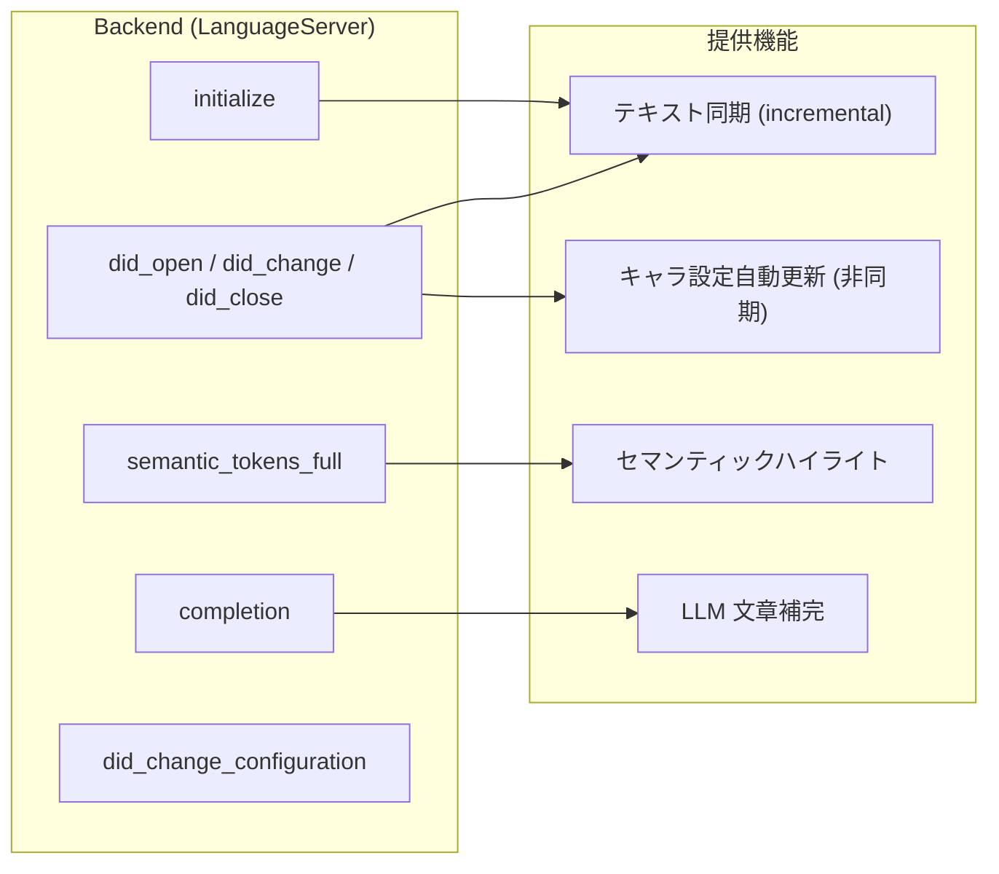

# LSP ハンドラ

## 機能マップ



## ハンドラ一覧

| ハンドラ | 役割 |
|---|---|
| `initialize` | capabilities 宣言、ワークスペース初期化、LLM / character_updater 設定読み込み |
| `initialized` | クライアント設定の取得 |
| `shutdown` | シャットダウン（現状は即時 OK） |
| `did_open` | 行単位テキスト保持、セマンティックトークン refresh |
| `did_change` | 増分更新、補完選択の記録 (debug)、キャラ更新トリガ、トークン refresh |
| `did_close` | ドキュメント状態のクリーンアップ |
| `semantic_tokens_full` | Lindera 形態素解析 → 品詞ベースの色分け |
| `completion` | カーソル文脈に応じた LLM 補完候補生成 |
| `did_change_configuration` | ランタイム設定変更 |
| `did_change_workspace_folders` | ワークスペースフォルダ変更 |

## 宣言される capabilities

`initialize` で返却する主要機能:

| Capability | 設定 |
|---|---|
| `textDocumentSync` | `INCREMENTAL` |
| `positionEncoding` | `UTF8` |
| `semanticTokensProvider` | full のみ（range 無効）、FiftyFour / file スキーム |
| `completionProvider` | トリガ: `、` `「` `『` / コミット: `。` `」` `』` |
| `selectionRangeProvider` | 有効 |

## 初期化オプション

Zed 拡張またはクライアント設定から渡される JSON:

```json
{
  "character_updater": {
    "enabled": true,
    "min_chars": 1000,
    "max_chars": 5000,
    "idle_timeout_secs": 180
  },
  "llm": {
    "ondemand": { "provider": "...", "model": "..." },
    "deferred": { "provider": "...", "model": "..." }
  }
}
```

`provider` は `google` / `openai` / `anthropic` / `xai` / `lmstudio` / `cloudflare` のいずれか。任意で `url`（エンドポイント上書き）・`capabilities`（`["structured_output","tool_calling"]`、未指定時はプロバイダ＋モデルから自動導出）を指定できる。

Cloudflare Workers AI を使う場合は `account_id`（Cloudflare アカウントID）が必須。エンドポイントは `https://api.cloudflare.com/client/v4/accounts/{account_id}/ai/v1/` として自動組み立てされ、認証は環境変数 `CLOUDFLARE_API_TOKEN` から取得する:

```json
{
  "llm": {
    "ondemand": {
      "provider": "cloudflare",
      "account_id": "＜Cloudflare アカウントID＞",
      "model": "@cf/meta/llama-3.1-8b-instruct"
    },
    "deferred": {
      "provider": "cloudflare",
      "account_id": "＜同上＞",
      "model": "@cf/meta/llama-3.1-8b-instruct",
      "capabilities": ["tool_calling"]
    }
  }
}
```

## 内部処理（LSP ハンドラ外）

| 関数 | 呼び出し元 | 役割 |
|---|---|---|
| `record_change` | `did_change` | 編集量を蓄積 → idle / max_chars でキャラ更新発火 |
| `update_all` / `update_partial` | `did_open` / `did_change` | `DashMap<uri, Vec<LineData>>` 更新 |
| `load_prompt` | `completion`, `character_updater` | プロンプト読み込み(実行ファイル隣接優先→埋め込みフォールバック) + YAML frontmatter |
